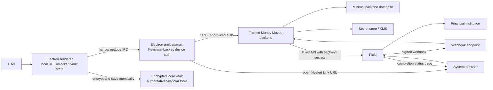

# Money Moves V3 Plaid Architecture

**Status:** Architecture candidate; no V3 implementation is present
**Architecture date:** 2026-08-11
**Baseline:** `12eed0a706c62598ed4f420a1ed12ea34bc38e8a` (`v2d-macos-release-accepted`)
**Candidate 3 parent:** `f912517e3fcd5233744cb69fa03a3d1471d60dc0`

## 1. Purpose and scope

This document defines the V3 live-bank-ingestion architecture without implementing Plaid, a backend, identity, a schema change, or any product behavior. It supersedes the PRD's older local Python service and OS-Keychain Plaid-token proposal only for V3 planning: the accepted product is now a Mac-first Electron application, and Plaid secrets require a trusted remote Money Moves backend.

Affected product requirements and invariants are PRD sections 4.3, 8, 10.2-10.9, 10.16, 10.18, 11-17; specifically TXN-004, ACT-001 through ACT-003, IMP-001 through IMP-003, AGT-001, AGT-002, SEC-001, SEC-002, and SEC-004. The controlling rules are:

- the encrypted local vault remains the durable, authoritative user financial store;
- provider and CSV facts normalize through one ingestion contract;
- provider categories are reference metadata only;
- user classification, allocations, reimbursement/refund interpretation, review state, and notes are never silently overwritten;
- signed amounts use safe integer cents: positive entering an owned account, negative leaving it;
- active finalized allocations equal the transaction magnitude;
- unknown data stays unknown;
- Plaid access tokens and client secret exist only in a backend-controlled encrypted secret boundary.

## 2. Accepted application discovery

### 2.1 Current architecture

| Area | Accepted state at the baseline | Safe V3 treatment |
|---|---|---|
| Runtime | Electron 43/Forge shell; `money-moves://app` local content; one sandboxed renderer; single-instance lock | Extend main/preload through narrow, validated IPC. Do not load third-party Link code in the accepted renderer. |
| Trust split | Renderer holds decrypted state and the vault key in memory. Main owns native dialogs and encrypted files but not plaintext vault contents. | Keep vault plaintext out of main. Put backend device authentication in main/Keychain, out of renderer and vault. |
| Vault | One encrypted version-2 envelope; AES-256-GCM; PBKDF2-SHA-256 at 600,000 iterations; schema version 9 | Preserve envelope and schema unchanged in this checkpoint. V3A later evolves the domain through an explicit migration. |
| File persistence | `active.mmvault`, `previous.mmvault`, and `pending.mmvault`; generation CAS, read-back verification, fsync, and atomic promotion | Use the existing repository save as the atomic V3A commit boundary. A sync batch is acknowledged only after this save succeeds. |
| Backup/restore | Manual encrypted `.mmvault` export; explicit verified restore; no merge or live sync | Backups carry local records and only opaque connection/checkpoint references, never Plaid or backend credentials. |
| Accounts | Canonical account foundation with stable local ID, optional institution/external ID, names, mask, type/subtype, currency, active state, optional balance, and explicit Unknown account | Evolve with provider-neutral connection/source identity and separate source versus user fields. Do not store Plaid account IDs locally. |
| Transactions | Canonical schema supports manual/CSV/migration, safe integer signed cents, dates, lifecycle, movement/review states, limited provider metadata, and manual overrides | Evolve to provider-neutral source namespaces, provenance, source snapshots, lineage, and tombstones. Do not add `plaid` fields to domain services. |
| Manual entry | The canonical source enum permits manual records, but there is no accepted manual-entry UI or dedicated canonical ingestion writer | Implement manual as an offline V3A adapter using the same batch validation/reconciliation path as CSV/provider records. |
| Allocations | Stable allocation IDs, exact magnitude validation, parent/child bucket references, ownership, notes, rollback-safe saves | Preserve IDs and user ownership. Add explicit interpretation-conflict handling for source amount changes. |
| Protected classifications | Reserved Income, Money Transfer, and Debt Payment records have explicit semantics; user bucket names cannot acquire those semantics | Provider categories and transaction codes never select or change these classifications. |
| Reimbursements | Schema/service foundation and audit records exist; no accepted product workflow | Ingestion may supply source facts only. It cannot create claims, payment links, or reimbursement meaning. |
| CSV | Legacy renderer parser immediately converts floats and commits to `review.transactions`; semantic fingerprints use amount/date/description-like data | Retain only for compatibility until V3A replaces it behind the adapter contract. This path is not safe for provider sync. |
| Services | Domain validators and allocation/bucket/reimbursement services are mostly persistence-agnostic; state service migrates, validates, and saves | Add an ingestion/reconciliation service above the vault repository and below UI workflows. |
| IPC | Frozen preload API; exact channel allowlist; main validates the trusted renderer origin and sanitizes errors | Add purpose-specific connection methods returning opaque IDs/status only; no generic HTTP, credential, URL, or IPC bridge. |
| Tests | 229 accepted full tests and 38 Electron-focused tests at V2D, including migrations, domain invariants, vault conflicts, backup/restore, renderer hardening, and release security | V3A adds offline adversarial adapter/reconciler fixtures. V3B-D add boundary/Sandbox suites without weakening existing tests. |

### 2.2 Architectural debt that matters to V3

1. The legacy CSV path parses amounts through JavaScript `Number`, applies `Math.abs`, infers meaning from provider-like categories, and writes the compatibility review collection. V3A must route CSV through lossless decimal parsing and the canonical batch reconciler.
2. Current `Transaction` conflates source facts and product interpretation and has no source namespace, opaque record reference, lineage, source revision, or durable tombstone. It cannot safely apply live provider patches as-is.
3. The current exact-allocation validator has no valid state for “source amount changed after allocation.” V3A needs an interpretation-conflict record or superseded snapshot so source facts can update without changing user-authored cents or violating the active allocation invariant.
4. The unlocked vault and key live in the renderer. That accepted local design makes a compromised renderer capable of reading unlocked local data, but it must not be allowed to escalate into Plaid/backend secret access. Main-owned Keychain credentials and a non-generic IPC façade create that containment boundary.
5. The Electron main process currently has no authenticated backend client and only allows a fixed Google external host. V3B/C must add exact backend and `secure.plaid.com` policies, response-size limits, TLS-only requests, and sanitized errors.
6. Historical Supabase code exists but is not an accepted runtime boundary. It must not be revived as a cloud vault or assumed to satisfy V3B identity, token custody, webhook, or cursor requirements.

These are bounded evolution seams, not a justification to rewrite accepted V2 buckets, allocations, reimbursements, devotionals, vault encryption, or backup behavior.

## 3. Recommended V3 topology

The backend is a secret broker and provider synchronization coordinator. It is not a cloud copy of the Money Moves vault. Normal durable transaction/account history remains only in the encrypted local vault.

## 4. Plaid Link architecture decision

### 4.1 Compared approaches

| Approach | Token path | Electron impact | OAuth/update behavior | Decision |
|---|---|---|---|---|
| A. Plaid Web Link in the renderer | Link token and `public_token` enter renderer callbacks; renderer loads Plaid script/iframe and needs expanded CSP/network access | Enlarges the most exposed process and gives a compromised renderer a token-exchange opportunity | Official and capable, but desktop OAuth/pop-up behavior and Link changes become renderer concerns | Reject for V3 private beta. It is supported, but conflicts with token minimization and the accepted locked-down renderer. |
| B. Hosted Link in the system browser | Backend creates/stores the Link token; main sees only a short-lived `hosted_link_url`; `SESSION_FINISHED` or `/link/token/get` delivers public token to backend | No Plaid script, public token, access token, or Plaid credentials enter renderer | Hosted Link supports Transactions and update mode. Browser handles OAuth; backend session state survives redirects | **Recommended.** Safest practical path under the token-isolation rule. |
| C. Money Moves-hosted web page wrapping Web Link | Backend web page/cookie session receives callback, then exchanges server-side | Avoids Electron token exposure but adds a custom internet-facing frontend, cookie/CSRF surface, CSP, and OAuth relay | Capable but provides no V3 beta advantage over Hosted Link | Do not build unless Hosted Link has a verified production-blocking limitation. |
| D. In-process Electron webview/BrowserView | Link runs inside app-controlled web content | Conflicts with current `webviewTag:false`, navigation isolation, and Plaid's guidance favoring Hosted Link when normal SDK use is unsuitable | Higher containment and OAuth complexity | Reject. |

### 4.2 Initial Link flow

1. Renderer invokes `connections.begin()` through the frozen preload API. It supplies no URL, token, provider ID, or backend credential.
2. Main loads the installation credential from macOS Keychain, obtains a short-lived backend access token, and requests a new connection session.
3. Backend creates `connection_session_id` and a random state/nonce, binds them to the backend user/device and intended environment, then calls `/link/token/create` with Transactions, the verified webhook URL, a registered HTTPS OAuth `redirect_uri`, and `hosted_link` configuration.
4. Backend retains the Link token encrypted with a short TTL and returns `{connectionSessionId, hostedLinkUrl, expiresAt}` to main. It returns only the opaque session ID to renderer.
5. Main validates scheme `https`, exact host `secure.plaid.com`, path prefix, absence of user info, response size, and expiration, then calls the system browser. The URL is never logged or persisted.
6. User completes Hosted Link and any financial-institution OAuth flow in the browser.
7. Plaid sends a signed `LINK/SESSION_FINISHED` webhook. Backend verifies the webhook before using `public_tokens`, verifies the Link token/session/user/environment binding, applies duplicate-Item checks, exchanges the public token at `/item/public_token/exchange`, and immediately encrypts the access token with a KMS-backed key.
8. Backend obtains minimal Item/account metadata, creates opaque Money Moves connection/account handles, and marks the connection session `connected` only after token custody and mapping commit atomically.
9. Renderer polls `connections.status(connectionSessionId)` through main. It receives only coarse state, opaque connection ID, institution display metadata, and actionable error code.
10. The browser completion page and any desktop wake-up are convenience signals. They never prove Link success. Only authenticated backend state can produce `connected`.

### 4.3 OAuth and desktop return

- Use a registered HTTPS `redirect_uri` owned by Money Moves for bank-to-Plaid/Hosted-Link return. The system browser remains the Link context across OAuth.
- Use an HTTPS `hosted_link.completion_redirect_uri` to a minimal Money Moves completion page. The page displays success/exit guidance based only on an opaque session lookup and contains no tokens or financial data.
- V3 private beta does not require an OS deep link. The desktop polls and resumes when focused. A later signed universal/custom-link hint may carry only an opaque session ID and nonce; main must still query backend authority.
- A redirect, browser close, Electron focus event, or `SESSION_FINISHED status=SUCCESS` without successful exchange/storage is not a completed connection.

### 4.4 Link lifecycle states

`created -> launched -> success_reported -> exchanging -> connected`

Terminal or side states are `exited`, `expired`, `duplicate_suspected`, `failed_retryable`, `failed_terminal`, and `cancelled`. State transitions use compare-and-swap and an idempotency key. Exit/cancel never creates a local connection. Expired or retryable initial sessions create a new Link session; public and Link tokens are never reused.

Before token exchange, backend compares Hosted Link `results.item_add_results` institution/name/mask metadata with active connections as Plaid recommends. A likely duplicate is blocked by default and routed to existing-connection status/update mode. Names or masks alone never merge local data. If a future explicit “connect separately” choice is approved, it creates a separate connection namespace and local accounts.

### 4.5 Update, error, and removal flows

- `ITEM_LOGIN_REQUIRED`, `PENDING_DISCONNECT`, and `PENDING_EXPIRATION` set a recoverable connection-health state and request update mode.
- Main requests an opaque update session. Backend calls `/link/token/create` with the existing access token server-side; Hosted Link opens in the system browser. The access token does not change and is not exchanged again after normal update-mode success.
- `LOGIN_REPAIRED` or a successful provider call may clear a recoverable alert after backend verification.
- A user exit leaves the Item in its prior state and offers retry; it does not mark it healthy.
- “Disconnect Bank” is an explicit backend command. Backend calls `/item/remove`, then marks the connection revoked and destroys access-token ciphertext/key association. A failed or ambiguous removal remains `disconnect_pending` and is retried; UI does not claim success early.
- Local accounts, transactions, allocations, claims, and audit history remain encrypted in the vault after remote removal. Local connection state becomes `disconnected`; source history is read-only unless the user separately requests local deletion.
- Reconnect after successful remote removal creates a new opaque connection identity. Mapping it to historical local accounts requires explicit user confirmation and a visible import cutover; no semantic transaction matching silently joins the histories.

## 5. Minimum backend identity

### 5.1 Recommendation: device-scoped pseudonymous identity

Use an installation-scoped pseudonymous user and device credential for the first private beta. Do not collect email/password or add social/account features.

| Element | Definition |
|---|---|
| Backend user ID | Server-generated random UUID/ULID with no email or vault-derived value. One beta installation begins with one user. |
| Device ID | Separate server-generated random identifier bound to that user. |
| Authentication credential | 256-bit random refresh credential generated/issued during device enrollment. Backend stores only a salted verifier/hash. Main exchanges it for short-lived, audience-scoped access tokens. |
| Client storage | macOS Keychain generic-password item restricted to the signed Money Moves application identity where platform APIs permit. Never in renderer storage, vault, backup, logs, command-line arguments, or environment files. |
| Rotation | Rotate refresh credential after enrollment, suspected exposure, explicit re-enrollment, and on a bounded schedule. Permit one previous verifier only for a short overlap; invalidate it after confirmed rotation. |
| Revocation capability | Generate a separate high-entropy revoke-only recovery code. Backend stores its hash. Require the user to acknowledge offline saving before first Link; it can revoke devices and remove Items but can never authenticate for data or sync. |
| Inactivity lease | Every active connection has a disclosed 90-day authenticated-device lease, renewed by normal app activity. Expiry queues `/item/remove`; it never deletes local vault history. |

This is smaller and more private than passwordless email, and operationally simpler than Sign in with Apple. Its deliberate limitation is no account recovery: loss of both Keychain credential and revoke-only code requires a new pseudonymous identity and re-linking. This limitation is appropriate only if disclosed and accepted for the first beta.

### 5.2 Lifecycle outcomes

- **Logout:** main deletes the Keychain credential only after the user chooses whether to disconnect remote Items. “Log out and disconnect” revokes device and removes Items. “Forget this Mac” without remote removal requires the revoke code warning.
- **Explicit revoke:** backend invalidates all device verifiers/access sessions, calls `/item/remove` for active connections, and retains only minimal security/removal audit metadata.
- **App deletion:** macOS may leave Keychain items behind. Reinstall attempts to reuse a valid item. Uninstall guidance tells the user to disconnect first; deletion is not treated as immediate server revocation. If no authenticated device renews the lease, backend removes the Item after the disclosed 90-day limit.
- **Credential lost:** the app cannot recover the old backend identity. The user uses the revoke-only code to remove remote Items, enrolls as a new identity, restores local history if available, and re-links. If both credential and code are lost, the old encrypted token remains unusable by the user and receives no desktop-requested sync; backend automatically calls `/item/remove` when the 90-day device lease expires. This bounded residual window is disclosed.
- **New Mac:** restore the encrypted vault, enroll a new backend identity, and re-link. No device credential is copied in the vault backup.
- **Same-Mac vault restore:** existing Keychain identity may still authenticate. A checkpoint mismatch forces restore reconciliation before incremental sync.
- **Different-Mac vault restore:** historical data is usable. Every restored live connection displays `relink_required` until a new connection is explicitly established.

Passwordless email is the preferred next step if beta experience proves cross-device recovery and remote revocation are worth the added PII, mail-delivery, session-recovery, and abuse surface. Sign in with Apple is not justified before that need exists.

## 6. Minimal backend persistence

The backend database may persist only the following logical records. Sensitive columns use envelope encryption with per-record data keys; key-encryption keys and Plaid client secret live in the secret store/KMS.

| Record | Minimum durable fields | Prohibited content |
|---|---|---|
| `backend_users` | opaque ID, status, timestamps, beta policy version | Email/name unless identity strategy is later approved; vault identifiers/content |
| `devices` | opaque device/user IDs, credential verifier, rotation generation, last seen, revoked time | Raw refresh credential, vault passphrase/key |
| `revocation_capabilities` | user/device scope, salted code hash, used/revoked time | Raw recovery code |
| `connection_sessions` | opaque session ID, owner/device, environment, Link-token ciphertext/reference, state/nonce, expiry, coarse result, idempotency key | Logged Link/public tokens, bank credentials, transaction payloads |
| `connections` | opaque connection ID, owner, provider/environment, encrypted access token, KMS key/version, encrypted or keyed Item lookup, institution ID/name if operationally needed, health, inactivity lease, update/revocation state, timestamps | Allocations, buckets, notes, journal content, vault key |
| `provider_accounts` | connection ID, opaque account handle, encrypted/keyed provider account ID, minimal official metadata/status | Routing/full account numbers; user-friendly local name |
| `sync_state` | connection ID, committed opaque provider cursor encrypted at rest, cursor version, sync-needed generation, health, last attempt/success, lease/CAS fields | Durable canonical transaction ledger |
| `prepared_sync_batches` | batch ID, connection/device, base/end cursor, payload digest, encrypted compressed payload, status, expiry, attempt counters | Plaintext payload at rest or retention after acknowledgement/expiry |
| `webhook_receipts` | signature/body digest, event type/code, environment, keyed Item lookup, received time, processing status, short retention | Full financial body after processing, tokens, descriptions |
| `security_audit` | opaque actor/request/connection IDs, operation, coarse result/error code, timestamp | Secrets or financial payloads |

### 6.1 Why temporary transaction batches are necessary

Fetching on desktop demand and retaining only a committed cursor is privacy-minimal but unreliable: a lost acknowledgement, backend restart, or provider mutation can cause the backend to produce a different payload for the same uncommitted cursor. Therefore the backend temporarily persists the exact prepared batch encrypted at rest until it is acknowledged or expires. It is a delivery journal, not a reporting ledger:

- content is inaccessible to product reporting/support;
- retention is short and bounded (recommended 24 hours after last delivery, immediate purge after acknowledged safety window);
- one prepared batch per connection/cursor version prevents divergent in-flight payloads;
- expiry never advances the committed cursor; a new batch is rebuilt from the committed cursor;
- backups and ordinary backend records never contain the payload.

## 7. Transactions Sync cursor/ack protocol

Plaid requires all pages to be pulled and requires a pagination loop to restart from its original cursor after a mutation-during-pagination failure. Money Moves adds a durable local acknowledgement barrier.

1. Desktop authenticates and requests sync for opaque `connectionId` with its last local receipt summary.
2. Backend locks/CASes `sync_state(cursorVersion=V, committedCursor=C0)`. If a matching prepared batch exists, it replays it byte-for-byte.
3. Otherwise backend fetches `/transactions/sync` from `C0`, following every `next_cursor` until `has_more=false`. It never exposes or commits intermediate cursors.
4. On `TRANSACTIONS_SYNC_MUTATION_DURING_PAGINATION` or an ambiguous page failure, discard all collected pages and restart the entire loop from `C0` with a bounded retry policy.
5. The Plaid adapter compacts pages into one deterministic provider-neutral batch, computes a canonical payload digest and batch ID, and persists encrypted payload plus `C0`, final `C1`, and `V` as `prepared`.
6. Desktop validates the complete batch, reconciles it in memory, validates the whole domain, and performs one existing atomic encrypted-vault save. The saved vault includes only a provider-neutral receipt `{connectionId, batchId, payloadDigest, appliedAt}`.
7. Only after durable save returns success does desktop acknowledge `{batchId, payloadDigest}` through main.
8. Backend transactionally checks prepared state, digest, device/connection ownership, `committedCursor=C0`, and `cursorVersion=V`; it advances to `C1`, increments the version, marks the batch acknowledged, and returns success.
9. An acknowledgement replay returns the already-committed result. An acknowledgement for a different payload/base/version fails closed and schedules reconciliation.

### 7.1 Crash and retry behavior

| Failure | Result |
|---|---|
| Any Plaid page fails | No batch and no cursor commit; restart from original cursor. |
| Backend crashes before prepared-batch commit | No cursor commit; fetch again from original cursor. |
| Backend crashes after prepared-batch commit | Replay identical encrypted batch. |
| Desktop validation fails | Vault unchanged; cursor unchanged; batch quarantined with safe error. |
| Disk full, vault conflict, or app crash before atomic save | Vault authority unchanged; no acknowledgement; replay later. |
| Vault save succeeds, acknowledgement is lost | Receipt is in vault; replay is recognized and acknowledgement is retried without duplicate mutation. |
| Backend commits acknowledgement but response is lost | Same acknowledgement is idempotently successful. |
| Duplicate sync request/device retry | Connection lease and prepared-batch identity return one batch. |
| Older backup restored after cursor advanced | Incremental sync is blocked. Same-device identity requests an explicit full restore reconciliation from a null provider cursor; different-device restore requires re-link. No “latest wins” merge occurs. |

The restore-reconciliation path is a required V3D acceptance test. Starting with a null `/transactions/sync` cursor currently requests the Item's full update history, but Money Moves must treat provider retention/coverage as fallible: compare account/source keys, surface coverage dates, never fabricate missing history, and retain restored local records.

## 8. Webhook model

The webhook endpoint is a notification intake, not a financial ledger.

1. Capture exact raw request bytes under a strict body limit before JSON normalization.
2. Require `Plaid-Verification`; decode only the header first; require `alg=ES256` and a syntactically valid `kid`.
3. Retrieve/cache the JWK through `/webhook_verification_key/get` using backend credentials; validate key use/curve/expiry and signature with a maintained JWT library.
4. Reject a JWT whose `iat` is more than five minutes old or unreasonably in the future; compare SHA-256 of the exact raw body with `request_body_sha256` using constant-time comparison.
5. Bind environment and keyed Item ID to an existing connection. Deduplicate by signature/body digest and event facts; tolerate duplicates and out-of-order delivery.
6. Commit a minimal receipt/queue job and return promptly. Never call the vault or do a full sync in the receiver request.

`SYNC_UPDATES_AVAILABLE` increments an idempotent `syncNeededGeneration`; it does not contain or commit transactions. `ITEM/ERROR`, `PENDING_DISCONNECT`, and `PENDING_EXPIRATION` update coarse connection health and user-action state. `LOGIN_REPAIRED` triggers a health recheck. Unknown event codes are stored only as a safe code/digest and cause no destructive action.

Missed webhook recovery is mandatory: an authenticated desktop refresh and a bounded backend health poll call `/item/get` and `/transactions/sync` from the committed cursor. Duplicate, out-of-order, or absent webhooks therefore affect latency, not correctness.

## 9. Backup, restore, disconnect, and reconnect

### 9.1 Backup contents

An encrypted backup may contain canonical account/transaction history, source audit snapshots, user interpretation, opaque connection/account/source handles, connection display state, and provider-neutral applied-batch receipts. It never contains Plaid client secret, access/public/Link tokens, raw backend refresh credential, KMS material, or raw Plaid Item/account identifiers.

### 9.2 Restore matrix

| Restore situation | Required behavior |
|---|---|
| Same Mac, Keychain identity valid, backup checkpoint equals backend | Resume normal sync after authenticated status check. |
| Same Mac, valid identity, backup checkpoint is older/newer/different | Mark connection `reconciliation_required`; preserve restored history and perform explicit full provider reconciliation before cursor advances. |
| Different Mac or missing credential | All historical data remains readable/editable. Restored connections become `relink_required`; no hidden backend recovery or token lookup occurs. |
| Restored vault plus new Link | New connection namespace. User explicitly maps accounts/cutover; semantic duplicate candidates are suggestions only. |

### 9.3 Local deletion is separate

Remote disconnect removes provider access and stops billing as required by Plaid. It does not delete encrypted local history. A future “delete local connection history” operation must be separately designed, preview affected allocations/claims/audit records, and never be implied by Disconnect Bank.

## 10. Phase boundaries and gates

### V3A - provider-neutral ingestion

No backend, Plaid dependency, credential, or network. Deliver the contract in `V3_CANONICAL_INGESTION_CONTRACT.md`, evolved schema/migration, adapter interfaces, deterministic reconciler, atomic vault application, tombstones/conflicts, and adversarial manual/CSV/synthetic-provider fixtures. Gate: all current tests plus V3A conformance tests pass; a fake provider proves no Plaid fields enter domain services.

### V3B - trusted backend and identity

Deliver pseudonymous device enrollment, Keychain custody in main, short-lived backend sessions, secret/KMS boundary, minimal database, redaction, rate limits, webhook verification foundation, revoke-only recovery, 90-day inactivity-lease removal worker, and no Plaid Link UI. Gate: renderer/vault secret-exfiltration tests, credential rotation/revocation, lost-device lease expiry, database-read threat test, and operational removal drill pass.

### V3C - Plaid Sandbox connection

Deliver Hosted Link/system-browser initial/update flows, backend public-token exchange, token encryption, Item health/removal, duplicate prevention, OAuth return, and Sandbox only. Gate: success/exit/expiry/duplicate/update/disconnect tests; renderer/vault token scans; no transaction sync persistence yet except minimum connection/account discovery agreed for the phase.

### V3D - transaction sync

Deliver `/transactions/sync`, signed webhook intake, prepared-batch cursor/ack protocol, Plaid adapter, encrypted local application, restore reconciliation, pending/posted lineage, modified/removed handling, and fault injection. Gate: every crash/retry case, pagination mutation restart, missed webhook recovery, and authoritative local-vault check passes.

### V3E - private-beta hardening

Deliver end-to-end failure UX, support bundle, rate/size limits, retention jobs, install/reinstall/device-loss drills, consent and privacy review, limited-production configuration, operations/runbooks, and live-readiness review. Gate: independent security/privacy architecture acceptance and explicit founder approval of remaining decisions.

Dependencies are strict and follow the roadmap: V3A requires architecture acceptance; V3B requires accepted V3A boundaries; V3C requires accepted V3B; V3D requires accepted V3A and V3C; V3E requires all prior acceptances. Design preparation may overlap, but implementation checkpoints and acceptance cannot be skipped or reordered. Sandbox access is never an excuse to collapse the phases.

## 11. Architecture quality check

| Check | Result |
|---|---|
| Local vault remains authoritative | Pass: backend holds only provider custody/operational state and temporary delivery batches. |
| No access token in renderer or vault | Pass: access token is backend/KMS only. |
| Backend is not a cloud transaction ledger | Pass: encrypted prepared payload is temporary, bounded, and unusable for reporting. |
| Allocations/user meaning remain authoritative | Pass: source changes preserve or quarantine prior interpretation; never rewrite it. |
| Provider categories remain metadata | Pass. |
| Pending/posted and removal preserve user work | Pass: stable local identity for explicit matches, audit snapshots, tombstones, and conflicts. |
| Retry/idempotency and cursor barrier | Pass: prepared batch, receipt, CAS acknowledgement, and replay rules are defined. |
| Missed webhooks recover | Pass: cursor sync/manual polling remains authoritative. |
| Backup/restore behavior | Pass: same-Mac reconciliation and different-Mac relink are explicit. |
| Provider fields isolated | Pass: opaque refs and provider adapter boundary. |
| V3A is offline | Pass. |
| Phase prompts can be bounded | Pass: dependencies and acceptance gates are explicit. |

No unresolved contradiction blocks architecture acceptance. Founder policy decisions are recorded separately and have recommended defaults.

## 12. Current official Plaid references

Verified 2026-08-11. Plaid behavior is temporally unstable; implementation phases must re-check these sources.

- [Hosted Link](https://plaid.com/docs/link/hosted-link/) - backend `SESSION_FINISHED`/`/link/token/get`, completion redirects, update-mode support, Hosted Link URL.
- [Link overview](https://plaid.com/docs/link/) and [Web Link](https://plaid.com/docs/link/web/) - Link/public-token lifecycle and Web callback behavior.
- [OAuth guide](https://plaid.com/docs/link/oauth/) - registered redirect URI, desktop OAuth testing, consent expiry/revocation.
- [Update mode](https://plaid.com/docs/link/update-mode/) - `ITEM_LOGIN_REQUIRED`, pending expiration/disconnect, unchanged access token.
- [Preventing duplicate Items](https://plaid.com/docs/link/duplicate-items/) - pre-exchange Hosted Link metadata checks and duplicate risks.
- [Items API](https://plaid.com/docs/api/items/) - public-token exchange, Item status, access-token lifetime, and `/item/remove` effects.
- [Transactions API](https://plaid.com/docs/api/products/transactions/) - `/transactions/sync`, signs, patches, cursors, pagination, mutation restart, and `SYNC_UPDATES_AVAILABLE`.
- [Transaction states](https://plaid.com/docs/transactions/transactions-data/) - pending removal plus posted addition, `pending_transaction_id`, unmatched removals, mutable posted records.
- [Webhook verification](https://plaid.com/docs/api/webhooks/webhook-verification/) and [webhook operations](https://plaid.com/docs/api/webhooks/) - ES256/JWK/body hash/age verification, retries, duplicate/out-of-order handling.
- [Sandbox](https://plaid.com/docs/sandbox/) - bypass Link for automation, login reset, dynamic transactions, and webhook firing; Sandbox limitations.
