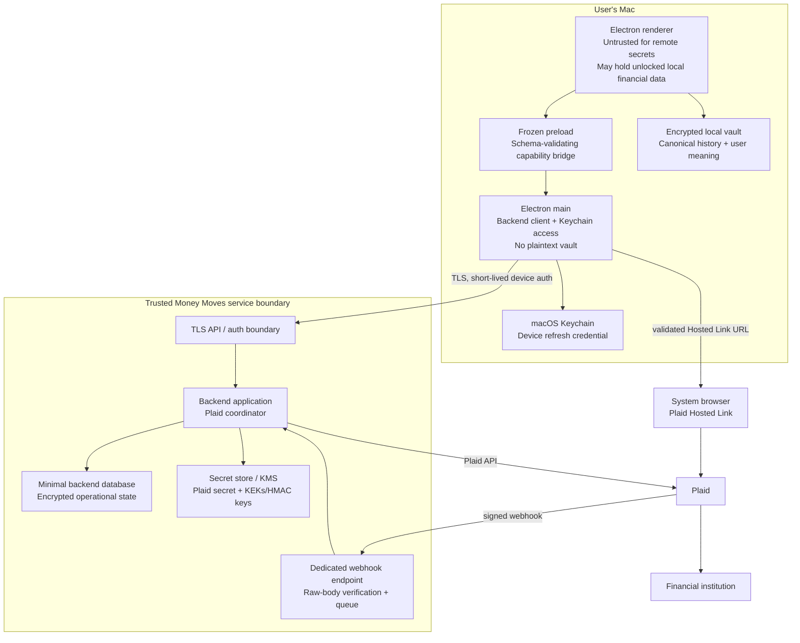

# Money Moves V3 Security and Trust Model

**Status:** Architecture candidate; controls are requirements, not implemented claims
**Scope:** V3A-V3E provider-neutral ingestion and Plaid boundary

## 1. Security objectives

1. A compromised renderer cannot obtain Plaid client secret, access/public/Link tokens, backend refresh credentials, KMS material, or a generic backend/network capability.
2. The encrypted local vault and its backups remain the only durable authority for canonical financial history and user interpretation.
3. Backend compromise is constrained by minimized records, envelope encryption, least privilege, short-lived transaction delivery, redaction, and revocation.
4. Provider notifications and payloads are untrusted until authenticated, bounded, normalized, and validated.
5. A cursor never advances ahead of a durable local vault apply.
6. User-authored classification, allocations, reimbursements/refunds/transfers, notes, and review history survive source churn.
7. Support and observability work without exposing financial payloads or credentials.

Local vault encryption protects copied/at-rest vault files, not a running unlocked app or a compromised macOS user session. Plaid access-token confidentiality depends on the backend and KMS, not the vault passphrase.

## 2. Trust-boundary diagram



The Renderer-to-Preload, Preload-to-Main, Main-to-Backend, Backend-to-Database/KMS, Browser-to-Plaid, Plaid-to-Institution, and Plaid-to-Webhook transitions are independent trust boundaries. Success at one boundary never implies authority at another.

## 3. Possession matrix

### 3.1 Electron renderer

**May possess:** decrypted local financial records while unlocked; in-memory vault key under accepted V2 architecture; user allocations/classifications/notes; opaque connection/session/account/source IDs; coarse connection health; safe batch counts/errors.

**Must not possess:** Plaid client secret, access token, public token, Link token, Hosted Link URL, raw Plaid Item/account/transaction IDs, backend refresh credential, backend signing/encryption keys, KMS material, generic authenticated fetch, webhook bodies, or plaintext temporary backend batches other than the provider-neutral batch being deliberately applied to the vault.

The renderer is not a remote-secret trust boundary. XSS or compromised packaged renderer can read unlocked vault data; containment prevents it from also becoming a bank-connection credential compromise.

### 3.2 Preload and Electron main

**May possess:** narrow IPC arguments/results; Keychain device credential only at point of use; short-lived Money Moves device-session token in memory; ephemeral Hosted Link URL in main memory; opaque backend IDs/status; encrypted vault envelope/file path metadata; a bounded provider-neutral source mutation batch transiently while relaying it to the renderer; application version/platform.

**Must not possess:** vault passphrase, vault encryption key, decrypted vault/user allocations/devotional content, Plaid client secret/access/public token, raw Plaid response, KMS keys, or a durable Hosted Link URL/Link token. Relayed source batches are never logged, cached, or persisted by main.

Main validates every IPC method, caller origin, argument type/length/enum, backend response, URL host/path, and error mapping. Preload exposes fixed methods, not `ipcRenderer`, HTTP, Keychain, shell, URL, or filesystem primitives.

### 3.3 Encrypted local vault

**May possess:** canonical local accounts and transactions; minimized source facts and source-change audit; user interpretation; local tombstones; opaque Money Moves connection/account/source handles; provider-neutral applied-batch receipts; connection display state; optional devotional journal/private notes.

**Must not possess:** Plaid client secret, access/public/Link token, raw Plaid credential, backend refresh/access token, device verifier, revoke-only code, backend server credentials, KMS key, raw Plaid Item/account ID, full provider payload, routing/full account number, or remote analytics identifier.

### 3.4 Trusted backend application

**May possess:** authenticated pseudonymous user/device IDs; access token plaintext only while making a Plaid call; public/Link tokens briefly during verified Link completion; provider response plaintext during bounded normalization; opaque connection/account handles; cursor/health state; encrypted prepared batch plaintext only during authorized delivery/processing; coarse audit data.

**Must not receive or persist:** vault passphrase/key/envelope plaintext; user allocations/buckets as authoritative cloud state; user review/notes/claims/refund interpretations; plaintext devotional journal; full-vault backup; unnecessary account/routing numbers; bank credentials; remote analytics payload.

### 3.5 Secret store/KMS

**May possess:** Plaid client secret; token/batch data-encryption-key wrapping keys; HMAC/opaque-handle derivation keys; key versions/rotation metadata.

**Must not possess:** vault passphrase/key, user interpretation, transaction descriptions, or general application logs. Applications receive narrowly scoped decrypt/sign operations; operators do not read secret values in ordinary workflows.

### 3.6 Backend database

**May possess:** device credential hashes/verifiers; opaque identity/mapping; encrypted Plaid tokens, encrypted/keyed provider IDs and cursor; connection/institution/health metadata; encrypted short-lived prepared batches; webhook/body digests; coarse security audit.

**Must not possess:** plaintext Plaid tokens/secrets, raw device credential/revoke code, durable plaintext transactions, vault/backup, allocations/notes, or bank credentials.

### 3.7 Plaid

**May possess:** Link/session/Item/access tokens; user-authorized institution/account/transaction data; credentials only as required by Plaid/financial-institution Link flow; configured Money Moves webhook and redirect URLs; Plaid client identity.

**Must not receive from Money Moves:** vault passphrase/key, local user classification/allocations/notes/devotional content, backend device credential, or cloud-vault copy.

### 3.8 Financial institution

**May possess:** its own customer credentials/account facts and OAuth consent; Plaid/Money Moves application authorization information appropriate to the flow.

**Must not receive:** Money Moves vault/user interpretation, backend device credentials, or Money Moves support logs.

### 3.9 Webhook endpoint

**May possess briefly:** exact raw request bytes, `Plaid-Verification` JWT, public token in verified Hosted Link completion, provider Item ID used for keyed lookup, webhook type/code/environment, request time.

**Must not:** log body/header/tokens; trust JSON before signature/body verification; perform vault work; do long provider sync; accept unsigned events; expose whether an Item/user exists; retain full body beyond bounded verified processing.

## 4. Desktop authentication controls

The first beta uses a pseudonymous device identity as specified in `V3_PLAID_ARCHITECTURE.md`.

- Enrollment is rate-limited, invitation/policy gated for private beta, and returns a 256-bit credential once over TLS.
- Backend stores an adaptive/salted credential verifier or keyed verifier appropriate to high-entropy material, never raw credential.
- Keychain item access is limited to the Money Moves signed application requirement where supported. Renderer cannot request arbitrary Keychain reads.
- Refresh credential exchanges only for short-lived access tokens with audience, subject/device, issued/expiry, token ID, and rotation generation. Backend API authorizes user + device + connection ownership per operation.
- High-risk commands (disconnect all, rotate, revoke) require recent credential proof, request nonce/idempotency key, and revalidation of target ownership.
- Rotation is transactional: issue/store next verifier, confirm client Keychain replacement, invalidate old after a short bounded overlap. Failed replacement leaves one recoverable valid generation, never two indefinite credentials.
- Revoke-only recovery code can revoke/remove but cannot list connections, obtain a session, sync, or read status. It is single-use, rate-limited, high entropy, and stored only as a hash.
- Before first Link, the user acknowledges offline custody of the revoke-only code. A disclosed 90-day connection lease is renewed only by authenticated device activity; lease expiry queues idempotent `/item/remove`. This bounds an orphaned remote Item when both Keychain credential and recovery code are lost.
- Credential, access token, and recovery code never enter the local vault, backup, renderer, logs, crash reports, URLs, or command lines.

## 5. Backend and secret custody

- Plaid secret resides in a managed secret store, not source, environment files in the repository, container images, database, CI logs, or desktop.
- Plaid access tokens use envelope encryption: random per-token data key, authenticated ciphertext bound to connection/provider/environment, KMS-wrapped data key, key version, and rotation metadata.
- Decrypt permission is limited to the Plaid-call worker; Link/session, webhook receiver, support, and ordinary read paths cannot decrypt access tokens.
- Sandbox and production secrets/keys/databases/queues are logically and cryptographically separated. Environment from client/webhook is never sufficient to select secret material.
- Raw public token is verified, exchanged promptly, and erased; retry storage, if essential, is encrypted and TTL-bound below its official 30-minute lifetime.
- Token compromise response is rotate/invalidate where supported or `/item/remove`, device/user session revocation, key rotation assessment, audit, and user notification policy.
- Database backup contains ciphertext only; restore drills prove KMS access control and no plaintext export.
- Outbound network policy allows exact Plaid API hosts and approved Money Moves dependencies. Provider response byte/time limits and circuit breakers apply.

## 6. IPC and network boundary

Illustrative preload surface:

```text
connections.enroll()
connections.begin()
connections.status(opaqueSessionId)
connections.list()
connections.beginUpdate(opaqueConnectionId)
connections.beginSync(opaqueConnectionId, localReceiptSummary)
// main returns one bounded provider-neutral source batch; no raw provider payload
connections.ackSync(opaqueConnectionId, batchId, payloadDigest)
connections.disconnect(opaqueConnectionId, confirmationNonce)
connections.revokeDevice()
```

There is no `fetch(url)`, `openExternal(url)`, `invoke(channel, args)`, `keychain.get(service)`, `provider.request`, or token getter. Main chooses backend routes and external hosts. Renderer-provided opaque IDs must match strict syntax/length and are still authorized server-side.

Backend uses TLS with normal platform certificate validation and HSTS at public endpoints. Do not add certificate pinning without an operational rotation design. MITM resistance relies on TLS, signed application/update integrity, Keychain custody, short token life, webhook signatures, and backend authorization.

## 7. Webhook zero-trust requirements

1. Dedicated TLS endpoint, POST only, strict content type, maximum bytes, and request deadline.
2. Preserve exact raw body bytes. Reject missing/oversized/multiple `Plaid-Verification` headers.
3. Decode unverified JWT header only to obtain `alg` and `kid`; require ES256 and bounded values.
4. Fetch/cached JWK through authenticated Plaid API; validate key `kid`, algorithm, EC/P-256 shape/use, creation/expiration, and cache lifetime/rotation.
5. Verify JWT signature using a maintained library.
6. Require reasonable `iat`; reject older than five minutes and excessive future skew.
7. SHA-256 exact raw bytes and constant-time compare with `request_body_sha256`.
8. Only then parse bounded JSON and validate event schema/environment/item lookup.
9. Deduplicate by verified signature/body digest and semantic event generation; tolerate duplicate/out-of-order webhooks.
10. Enqueue minimal work and return inside Plaid's delivery deadline. Webhook merely marks sync/health state.

IP allowlists may be defense-in-depth but are not authenticity because documented addresses can change. Signature and exact body integrity are mandatory Money Moves policy even though Plaid describes verification as optional.

## 8. Privacy, logging, and support

### 8.1 Logging taxonomy

| Class | Examples | Retention/access |
|---|---|---|
| Operational-safe | opaque request/connection/device IDs, endpoint/event type, coarse state, duration bucket, HTTP/provider error code, retry count, batch count/bytes, software version | Normal restricted operational log with bounded retention. |
| Security audit | enrollment/rotation/revoke/disconnect, auth failure reason class, webhook verification result, KMS key version, administrative action | Append-oriented restricted audit; longer policy-controlled retention. |
| Ephemeral sensitive | exact webhook body, provider response, prepared batch plaintext, public/access token in worker memory | Never logged; memory/TTL only. |
| Prohibited | secrets/tokens/credentials; full descriptions; account/routing numbers; full financial payload; vault/passphrase/key; allocations/notes; journal/devotional content; search text | Must not be collected. Build/test scanners fail on representative patterns. |

Structured logger accepts typed allowlisted fields, not arbitrary objects or string interpolation. Redaction runs before serialization and again at transport. Errors are mapped to stable codes and safe messages; stacks remain local to restricted backend telemetry only after secret scanning and never reach renderer.

Request IDs are random and not provider tokens. Opaque connection IDs may appear in restricted logs but not third-party analytics. No remote product analytics receive financial, search, institution, account, transaction, bucket, location, claim, or devotional data.

### 8.2 Support workflow

The user can export a privacy-safe diagnostic bundle containing app/backend versions, coarse connection state, last safe error code/timestamps, opaque support connection/batch IDs, batch counts, vault schema/generation status, and redaction report. Payload digests are not exported. It excludes descriptions, amounts, balances, account names/masks, transactions, allocations, notes, tokens, paths/usernames, Keychain data, and vault content.

Support searches by opaque support ID and Plaid `request_id` only in restricted systems. A user may separately consent to a narrow screenshot or manually described issue; support must not request vault passphrase, access token, raw vault, bank credentials, or full provider payload.

## 9. Threat model

| Threat | Asset / boundary | Required mitigation | Residual risk |
|---|---|---|---|
| Compromised renderer/XSS | Unlocked vault; renderer→main/backend | CSP/no remote scripts; sandbox/context isolation; frozen narrow IPC; no device/token/URL getters; server ownership checks | Unlocked local financial data and user actions remain exposed until lock/quit. |
| Malicious renderer IPC | Keychain credential/backend commands | Exact methods, types/lengths/enums, origin check, main-selected routes, confirmations/idempotency, rate limit | Attacker may request allowed actions while renderer is compromised; sensitive destructive actions require explicit confirmation/recent auth. |
| Stolen encrypted vault/backup | Local file boundary | AES-GCM, strong KDF, authenticated envelope, file permissions, no remote secrets | Offline passphrase attack; metadata from filesystem remains visible. |
| Stolen Keychain device credential | Keychain→backend | Signed-app ACL where feasible, short access tokens, rotation/revocation, anomaly/rate controls, no vault key | Attacker can operate remote connections as device until revoked; cannot decrypt vault/user interpretation. |
| Backend database read | DB→KMS | Envelope encryption, credential hashes, keyed provider IDs, no vault/cloud ledger, separate KMS IAM | Institution/health/timing metadata and ciphertext volume leak. |
| Backend application compromise | App→KMS/Plaid | Least-privilege workers, network/IAM segmentation, audited KMS decrypt, token-by-token access, rotation/removal response | Active worker compromise can decrypt accessible tokens and fetch provider data; highest V3 residual risk. |
| Leaked Plaid access token | Backend secret | Token encrypted at rest, never logged/client-side, invalidate/remove Item, incident audit | Token plus stolen client credentials could expose provider-authorized data until revoked. |
| Webhook spoofing | Internet→webhook | ES256 JWK signature, exact raw-body hash, age/environment/item binding, body limits | Plaid/key compromise; availability attacks remain. |
| Webhook replay | Webhook queue | Five-minute age rule, verified body/signature digest idempotency, monotonic state | Very-close replay causes bounded duplicate work only. |
| Cursor desynchronization | Plaid→backend→vault | Prepared batch; all-page rule; original-cursor restart; vault receipt; ack CAS; restore reconciliation | Provider retention gaps or operational corruption require visible rebaseline/manual repair. |
| Sync replay | Backend→desktop | Batch ID + canonical digest + local receipt + source-key idempotency | Reconciliation bugs can still repeat non-idempotent audit events; adversarial tests required. |
| Duplicate bank link | Browser/Plaid→backend/local accounts | Pre-link warning; pre-exchange metadata check; separate namespace; explicit mapping/cutover; no semantic auto-merge | Institution metadata may be incomplete; OAuth duplicate may invalidate an existing Item. |
| MITM | Main/browser/backend/Plaid | TLS validation, HSTS, signed webhooks, short sessions, no token in redirect, verified backend status | Compromised root CA/host/device can defeat transport assumptions. |
| Malicious/invalid provider payload | Provider adapter→domain | Closed schema, lossless parsing, allowlists, safe integers, relationship validation, quarantine, atomic apply | Novel valid-looking semantic errors require user review. |
| Oversized payload/DoS | Webhook/provider/backend→desktop | Byte/count/depth/time caps, pagination caps, streaming/bounded parsing, quotas, circuit breakers | Legitimate very large histories may require chunked prepared windows without cursor violation. |
| Local disk full | Reconciler→vault | Existing pending/read-back/fsync/atomic promotion; acknowledge only after success | User cannot sync until space is restored; backend retains bounded prepared batch. |
| App crash during sync | Renderer/vault→backend ack | Atomic vault save, receipt, replay, idempotent ack | Crash after unlock exposes normal OS memory risk; no cursor loss. |
| Backup restored over newer state | Restore→backend cursor | Explicit confirmation, receipt comparison, incremental sync block, full reconciliation/relink, no automatic merge | Provider may no longer supply all historical coverage; restored local history remains but coverage is flagged. |
| Main-process compromise | Renderer/main→Keychain/backend | Code signing/notarization, hardened runtime policy, no plaintext vault in main, least Keychain/backend capability | Device credential and remote connection control are exposed; vault plaintext remains separated unless renderer also compromised. |
| Secret in logs/errors | All boundaries | Typed logger, double redaction, token-pattern scans, safe codes, no arbitrary payload logging | Novel secret formats or developer debug bypass; release gate and review required. |
| Insider/support abuse | Ops→logs/DB/KMS | Separation of duties, no ordinary decrypt, audited break-glass, opaque support bundles, least access/retention | Privileged collusion or break-glass abuse cannot be eliminated. |
| Provider/account revoked | Institution/Plaid→backend | Item health polling/webhooks, update mode, disconnect state, consent/retention policy | Detection can lag; local history remains by user product request subject to legal review. |

## 10. Security acceptance gates by phase

### V3A

- Fuzz/limit/currency/sign tests and rollback injection pass offline.
- Provider metadata cannot mutate user-owned fields.
- Source conflict/tombstone retains user work and excludes invalid active totals.
- No network, Plaid package, credential, or provider-specific domain enum.

### V3B

- Renderer and vault scans prove absence of backend credentials/secrets.
- Keychain lifecycle, credential rotation overlap, revoke-only capability, uninstall/reinstall, and stolen-credential revocation tests pass.
- Database snapshot contains only ciphertext/verifiers/minimal metadata.
- KMS/IAM, structured logging, rate/size limits, and incident runbook receive independent review.
- Webhook verification rejects altered body, wrong algorithm/key/environment, expired/future JWT, replay, unknown Item, and oversized input.

### V3C

- Initial/update/exit/expiry/duplicate/OAuth/disconnect paths keep public/access/Link tokens outside renderer/vault/logs.
- Main opens only a validated Hosted Link URL; completion redirect cannot set connection success.
- Sandbox/production separation and `/item/remove` retry behavior pass.

### V3D

- Cursor cannot advance before fault-injected durable vault success.
- All pagination/crash/ack/replay/restore cases pass.
- Missed, duplicated, and out-of-order webhooks converge through sync.
- Temporary batch encryption/retention/purge and support redaction pass.

### V3E

- Independent application/backend threat-model review; dependency and infrastructure scan; secret rotation and database-restore drill; least-privilege audit; consent/retention/legal review; production incident/tabletop and removal tests.
- Any unmitigated path from renderer/vault/logs to Plaid/backend secrets blocks private-beta release.
